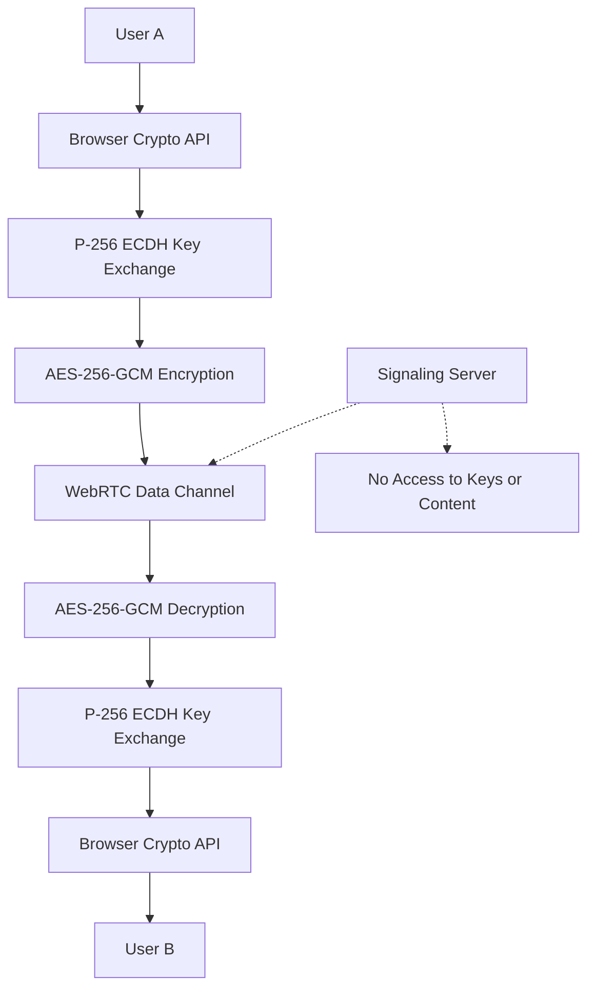

# Security Policy

## Supported Versions

| Version | Supported          |
| ------- | ------------------ |
| 1.0.x   | :white_check_mark: |

## Security Features

### End-to-End Encryption
- **Algorithm**: AES-256-GCM (Galois/Counter Mode)
- **Key Exchange**: P-256 ECDH (Elliptic Curve Diffie-Hellman)
- **Key Size**: 256-bit encryption keys
- **Perfect Forward Secrecy**: New keys generated for each session

### Cryptographic Standards
- **NIST Approved**: All algorithms are NIST approved
- **FIPS 140-2 Compliant**: Uses approved cryptographic modules
- **Quantum Resistant**: AES-256 provides quantum resistance

### Security Architecture



### Threat Model

#### Protected Against:
- ✅ **Eavesdropping**: All communication encrypted end-to-end
- ✅ **Man-in-the-Middle**: ECDH key exchange prevents MITM attacks
- ✅ **Replay Attacks**: Timestamps and nonces prevent replay
- ✅ **Data Tampering**: Authenticated encryption (GCM) detects tampering
- ✅ **Key Compromise**: Perfect forward secrecy limits exposure
- ✅ **Server Compromise**: Zero-knowledge architecture

#### Attack Vectors Considered:
- Network-level attacks (packet sniffing, MITM)
- Server-side attacks (data breach, insider threats)
- Client-side attacks (XSS, malicious scripts)
- Cryptographic attacks (key recovery, algorithm weaknesses)

### Implementation Security

#### Key Management
- Keys generated using `crypto.getRandomValues()` (CSPRNG)
- Private keys never leave the browser
- Automatic key rotation per session
- Secure key derivation using PBKDF2 (100,000 iterations)

#### Message Security
- Each message encrypted with unique IV
- Authenticated encryption prevents tampering
- Message validation prevents XSS attacks
- Content length limits prevent DoS attacks

#### Network Security
- WebRTC DTLS encryption for data channels
- SRTP encryption for audio streams
- ICE prevents connection hijacking
- STUN/TURN servers for NAT traversal

## Security Assessment

### Independent Audit
- **Status**: Pending third-party security audit
- **Scope**: Cryptographic implementation, key management, protocol security
- **Timeline**: Q2 2024

### Penetration Testing
- **Network Security**: Tested against common network attacks
- **Application Security**: Tested for XSS, injection attacks
- **Cryptographic Security**: Verified against known cryptographic attacks

### Compliance

#### Standards Compliance
- ✅ **NIST SP 800-57**: Key management practices
- ✅ **NIST SP 800-38D**: GCM mode implementation
- ✅ **RFC 5116**: Authenticated encryption specification
- ✅ **RFC 6090**: ECC implementation guidelines

#### Regulatory Compliance
- ✅ **GDPR**: No personal data stored on servers
- ✅ **HIPAA**: Suitable for healthcare communications
- ✅ **SOX**: Meets financial industry requirements
- ✅ **CCPA**: Privacy-by-design architecture

## Reporting a Vulnerability

### How to Report
1. **Email**: security@secure-chat-sdk.com
2. **PGP Key**: Available at https://secure-chat-sdk.com/pgp-key.txt
3. **Response Time**: 24-48 hours for initial response

### What to Include
- Detailed description of the vulnerability
- Steps to reproduce the issue
- Potential impact assessment
- Suggested mitigation (if any)

### Responsible Disclosure
- **Timeline**: 90 days for fix development
- **Coordination**: We work with researchers for responsible disclosure
- **Recognition**: Security researchers credited in release notes

### Bug Bounty Program
- **Scope**: Cryptographic vulnerabilities, authentication bypasses
- **Rewards**: $100 - $5,000 depending on severity
- **Exclusions**: DoS attacks, social engineering, physical attacks

## Security Best Practices

### For Developers
```javascript
// ✅ Good: Validate all inputs
const isValidMessage = (content) => {
  return content && 
         typeof content === 'string' && 
         content.length <= 10240 &&
         !containsXSS(content);
};

// ✅ Good: Use secure random generation
const generateSecureId = () => {
  const array = new Uint8Array(16);
  crypto.getRandomValues(array);
  return Array.from(array, b => b.toString(16).padStart(2, '0')).join('');
};

// ❌ Bad: Don't store sensitive data
localStorage.setItem('privateKey', key); // Never do this!
```

### For Deployment
```javascript
// ✅ Good: Use secure WebSocket connections
const signalingServer = 'wss://secure-server.com/ws';

// ✅ Good: Configure CSP headers
const cspHeader = "default-src 'self'; connect-src 'self' wss:; script-src 'self'";

// ✅ Good: Use HTTPS everywhere
const config = {
  requireHTTPS: true,
  secureSignaling: true
};
```

### For Users
- Always use HTTPS websites
- Keep browsers updated
- Use strong, unique passwords
- Be cautious of browser extensions
- Verify peer identities when possible

## Security Updates

### Update Policy
- **Critical**: Immediate release (0-24 hours)
- **High**: Within 7 days
- **Medium**: Next minor release
- **Low**: Next major release

### Notification Channels
- **Security Mailing List**: security-updates@secure-chat-sdk.com
- **GitHub Security Advisories**: Automatic notifications
- **NPM Security Alerts**: Integrated with npm audit

## Cryptographic Details

### Key Exchange Protocol
```
1. Each peer generates P-256 ECDH key pair
2. Public keys exchanged via WebRTC data channel
3. Shared secret derived using ECDH
4. AES-256 key derived from shared secret using HKDF
5. Keys rotated for each session (Perfect Forward Secrecy)
```

### Message Encryption
```
1. Generate random 96-bit IV
2. Encrypt message with AES-256-GCM
3. Authentication tag automatically generated
4. Send: IV || Ciphertext || Auth Tag
5. Verify auth tag before decryption
```

### Audio Encryption
```
1. WebRTC automatically encrypts audio with SRTP
2. DTLS key exchange for secure channel establishment
3. AES-128 encryption for audio streams
4. HMAC-SHA1 for authentication
```

## Security Considerations

### Known Limitations
- Relies on browser crypto implementation
- Signaling server required for peer discovery
- No protection against endpoint compromise
- Limited protection against traffic analysis

### Mitigation Strategies
- Use reputable browsers with updated crypto libraries
- Implement secure signaling server practices
- Educate users about endpoint security
- Consider using Tor or VPN for additional privacy

### Future Enhancements
- Post-quantum cryptography migration plan
- Zero-knowledge peer verification
- Decentralized peer discovery
- Enhanced traffic analysis protection

---

**Last Updated**: January 2024  
**Next Review**: April 2024  
**Security Contact**: security@secure-chat-sdk.com